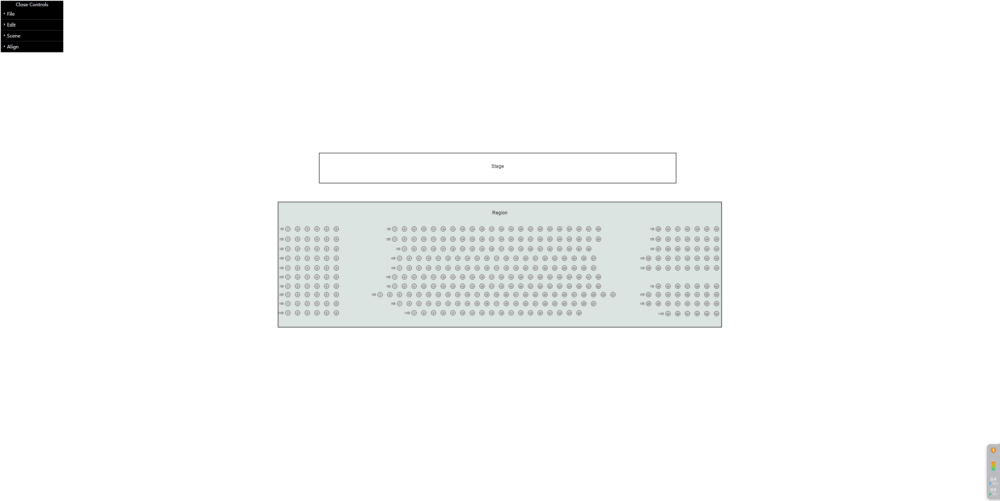
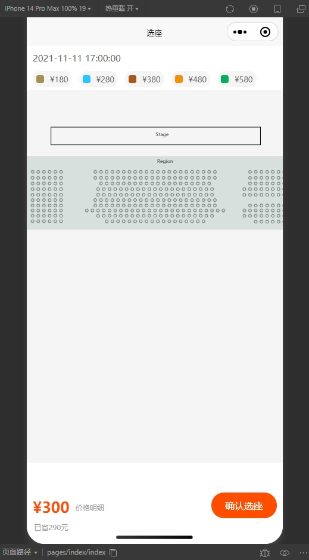
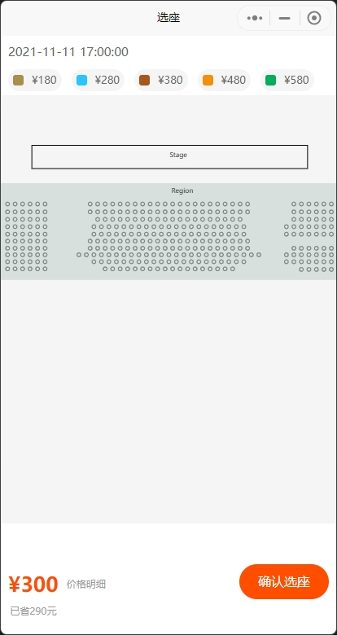

# seat-uni-app
seat-uni-app
控制台效果


小程序虚拟器效果

小程序手机效果



# release

```
 sudo scp -r /Users/gaoyang/Documents/taobao/qingwa/unpackage/dist/build/h5/index.html root@139.196.40.161:/root/qingwah5
 sudo scp -r /Users/gaoyang/Documents/taobao/qingwa/unpackage/dist/build/h5/static root@139.196.40.161:/root/qingwah5

```
